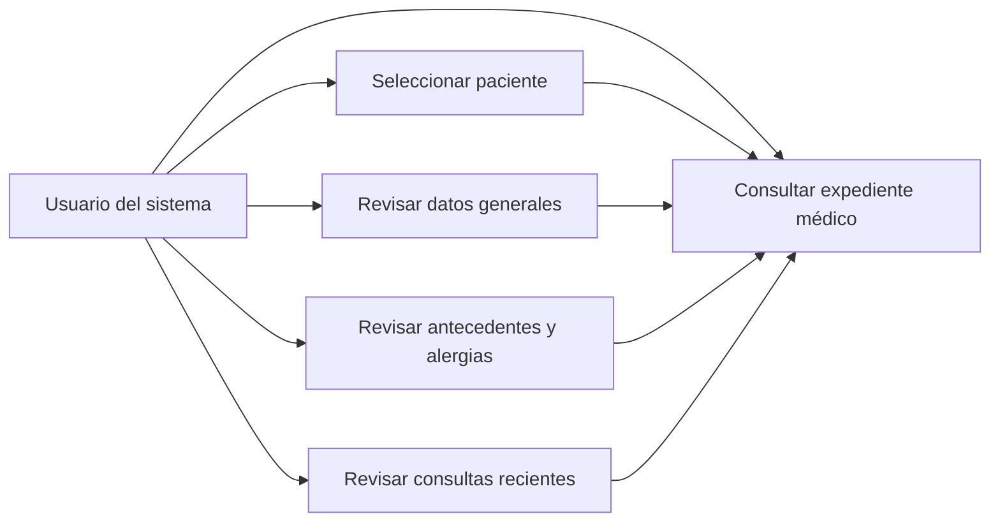
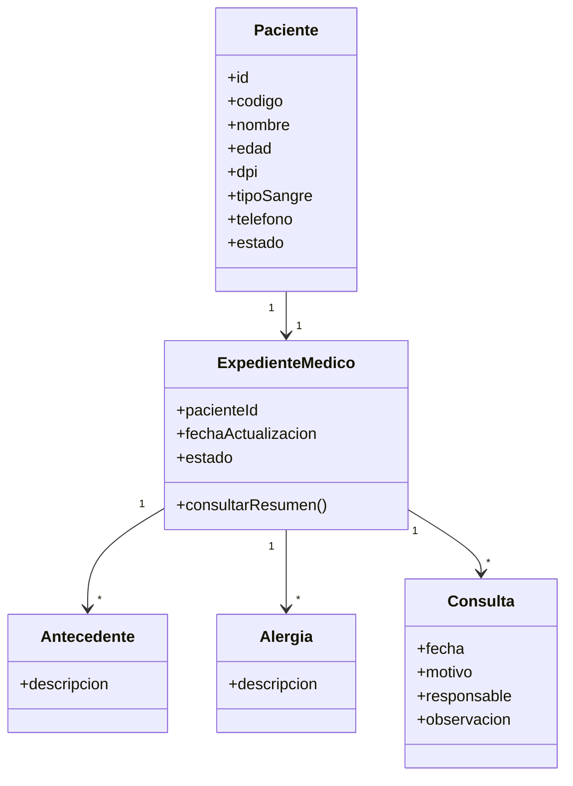
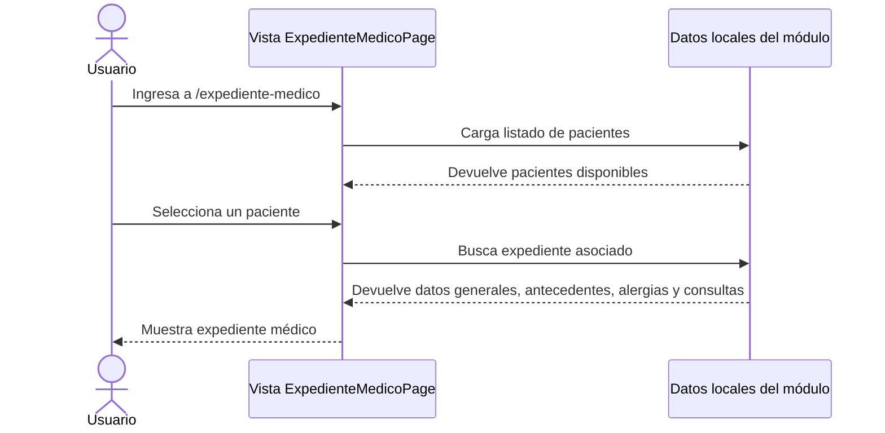

# Diagramas UML - Módulo 13 Expediente médico

## Caso de uso



## Diagrama de clases



## Diagrama de secuencia



## Verificación aplicada

Se ejecutó la compilación del frontend con:

```bash
npm run build
```

El resultado fue correcto, sin errores de compilación.

## Decisión humana tomada

Se implementó el módulo como una vista frontend base porque el requerimiento asignado solicita una vista de expediente médico asociada a un paciente. No se modificó autenticación, tenant ni backend, porque no forman parte directa del módulo 13.

## Cambios realizados

- Creación del módulo `expediente-medico`.
- Creación de la vista `ExpedienteMedicoPage.vue`.
- Registro de la ruta `/expediente-medico`.
- Agregado del enlace de navegación en el layout principal.
- Implementación de selector de paciente y secciones del expediente.
